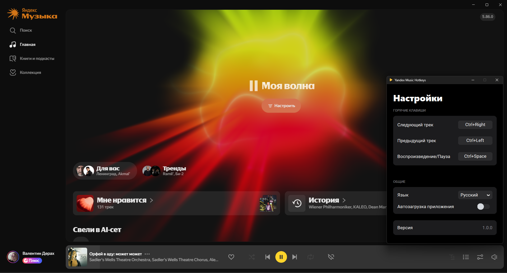

[English](README.md) | Русский

## Yandex Music Hotkeys 

Глобальные горячие клавиши для управления приложением Яндекс Музыка в Windows.<br>
Приложение работает в фоне и позволяет управлять воспроизведением, даже если окно Яндекс Музыки свернуто или не в
фокусе.



## Горячие клавиши по умолчанию

| Действие              | Комбинация                |
|-----------------------|---------------------------|
| Следующий трек        | `Ctrl` + `Right` (→)      |
| Предыдущий трек       | `Ctrl` + `Left` (←)       |
| Воспроизведение/Пауза | `Ctrl` + `Space` (Пробел) |

## Установка и запуск

### Вариант 1: Использование EXE файла

Скачайте [YMHotkeys.exe](https://github.com/valentderah/yandex-music-hotkeys/releases/download/v1.0.0/YMHotkeys.exe) из раздела
[релизов](https://github.com/valentderah/yandex-music-hotkeys/releases).

### Вариант 2: Самостоятельный запуск или сборка

1. Клонируйте репозиторий.
2. Установите зависимости:
   ```bash
   pip install -r requirements.txt
   ```
3. Запустите приложение:
   ```bash
   python main.py
   ```

ИЛИ

3. Cборка своего .exe:
   ```bash
   python build.py
   ```